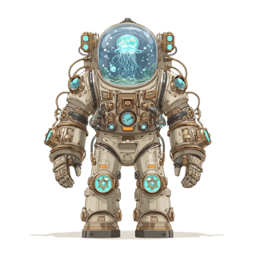
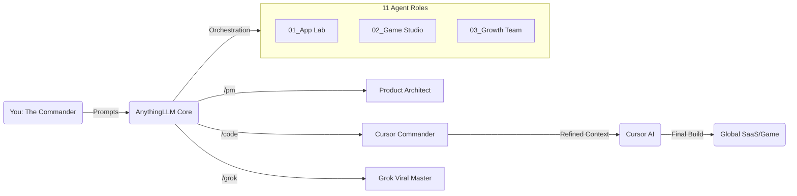

  

 

  

 

<table>
  <tr>
    <td width="60%" valign="top">
      <h2>👨‍🚀 Hi, I'm Alrescha</h2>
       
      <b>Global Product Architect (CPO) & Indie Hacker</b>
       
      <i>Captain of the "Alrescha" Starship.</i>
        
      Welcome aboard!  I am the Captain of this digital starship and a Global Product Architect.  I specialize in navigating the chaos of product development. My mission is to help founders turn wild ideas into global applications using AI-Native workflows. I don't just write code; I orchestrate AI agents to build scalable systems.  
      <b>Currently exploring the edge of the universe with:<b>
        
      <ul>
        <li>🔭 <b>Stack:</b> Next.js, Supabase, Tailwind, Framer Motion</li>
        <li>🤖 <b>AI Ops:</b> Cursor, Midjourney, v0.dev</li>
        <li>🌍 <b>Focus:</b> US/EU Tier 1 Markets</li>
      </ul>
       
      
      &nbsp; 
    </td>
    <td width="40%" align="center" valign="middle">
      
    </td>
  </tr>
</table>

 

## 🤖 Industrial Vibe Coding Architecture
> "I don't write code; I orchestrate intelligence."

