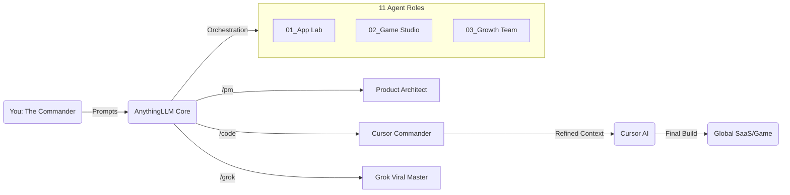

  

  

  

 

## 🤖 Industrial Vibe Coding Architecture
> "I don't write code; I orchestrate intelligence."

```mermaid
graph LR
    Command(You: The Commander) -->|Prompts| Brain(AnythingLLM Core)
    Brain -->|/pm| PM[Product Architect]
    Brain -->|/code| Dev[Cursor Commander]
    Brain -->|/grok| Mkt[Grok Viral Master]
    subgraph Agents [11 Agent Roles]
        direction TB
        A[01_App Lab]
        B[02_Game Studio]
        C[03_Growth Team]
    end
    Brain -->|Orchestration| Agents
    Dev -->|Refined Context| Cursor(Cursor AI)
    Cursor -->|Final Build| Product(Global SaaS/Game)
```
